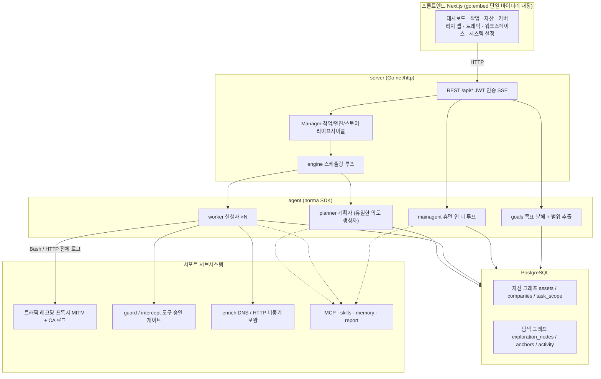
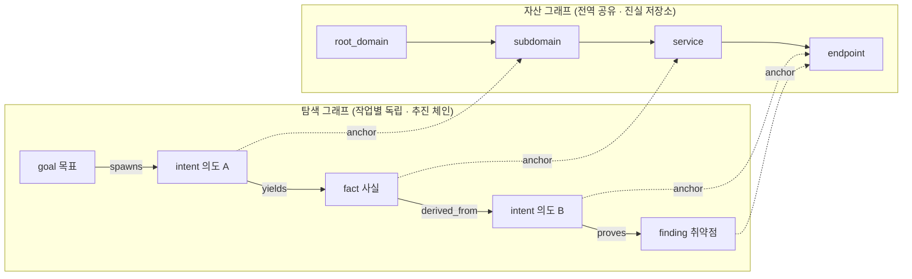
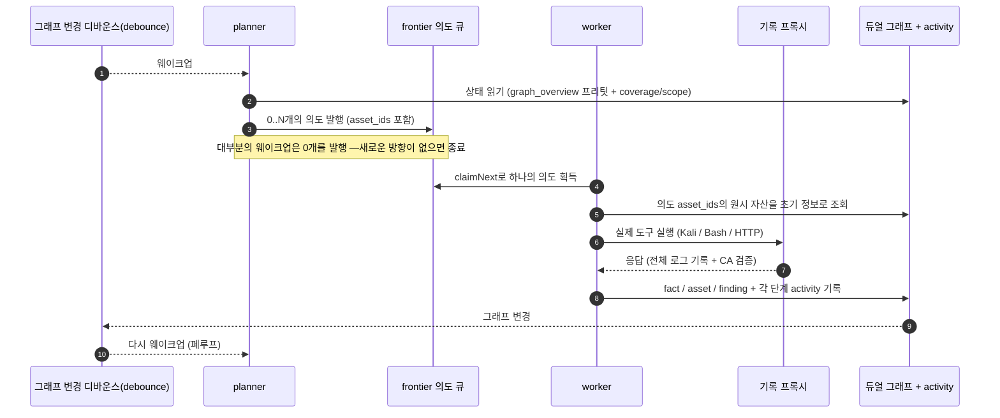
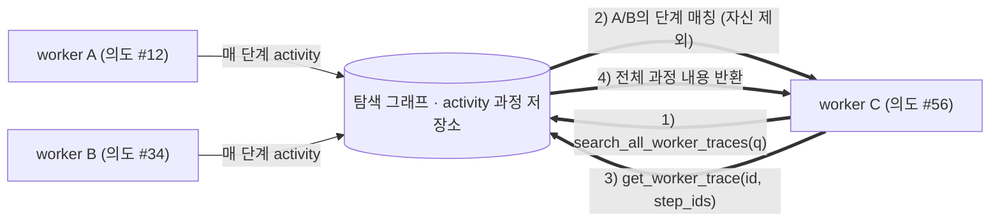
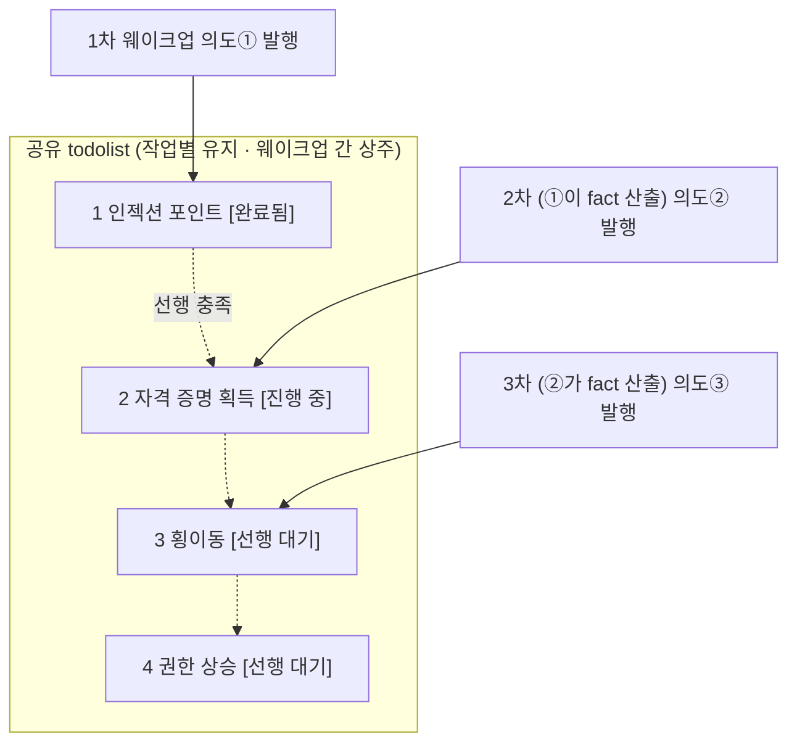
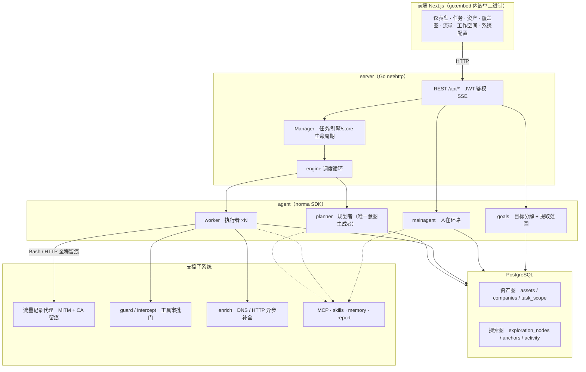
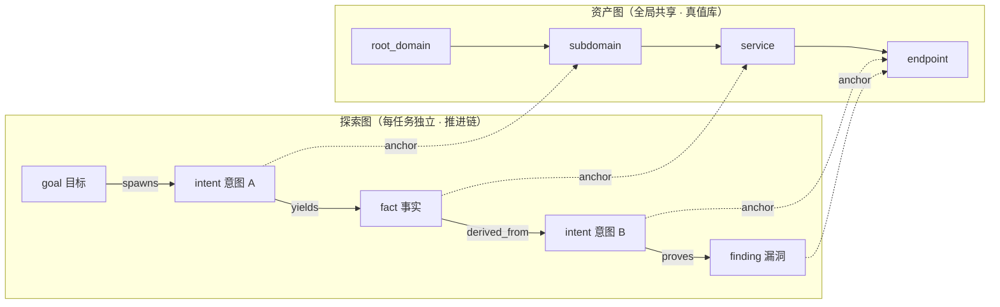
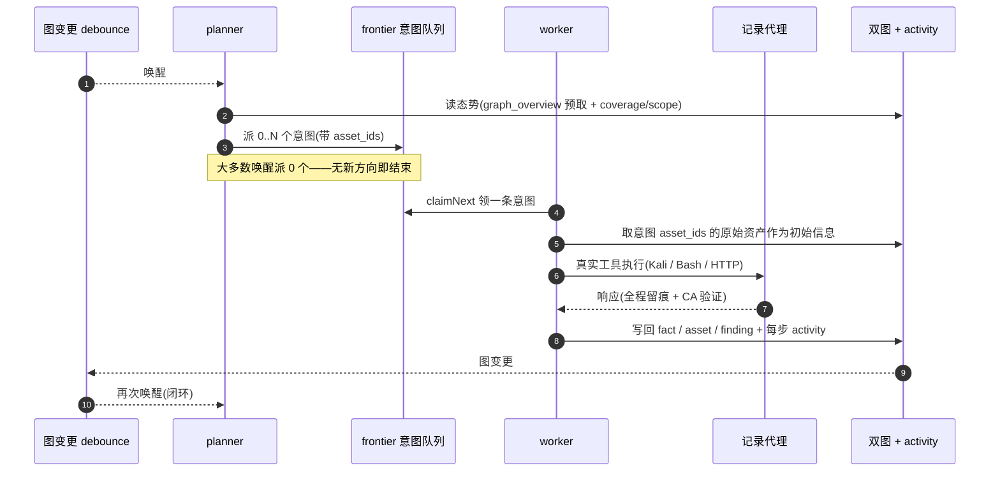
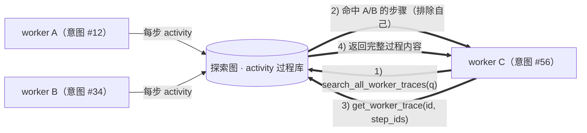
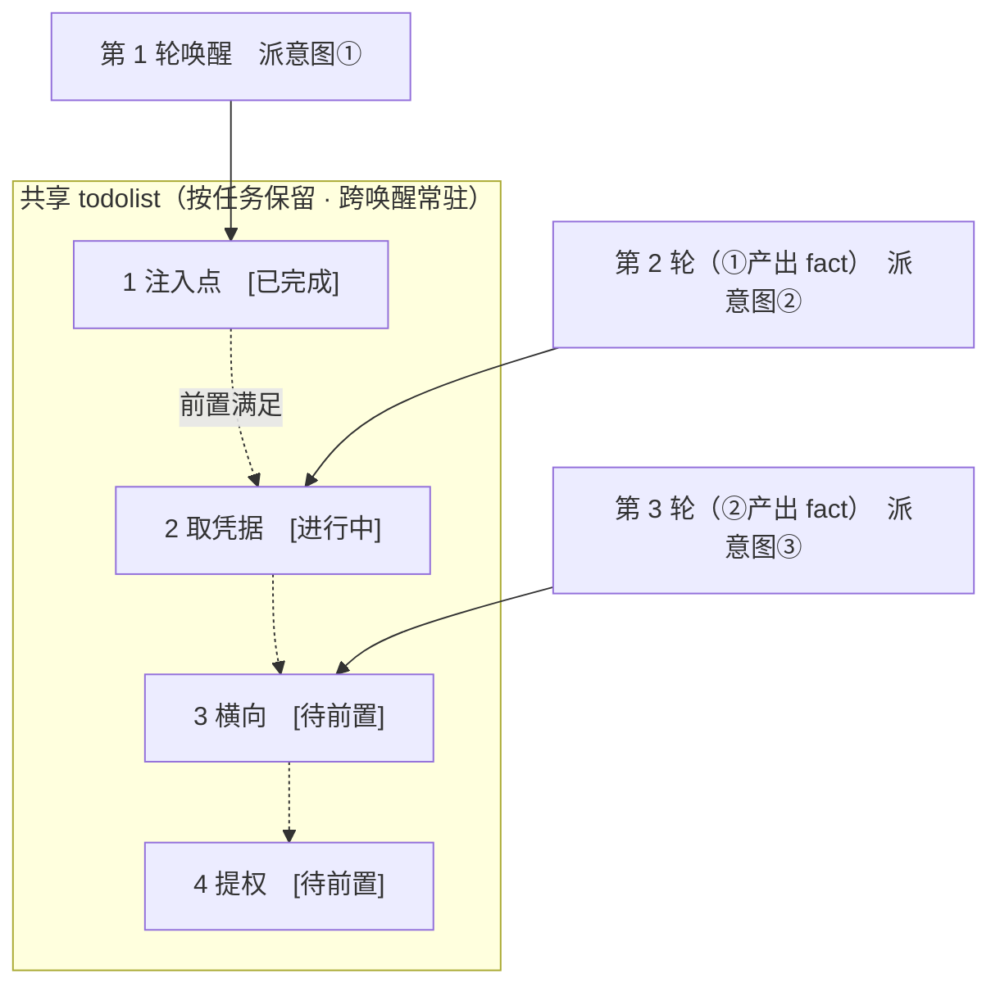

```markdown
<div align="center">

# ARTEX

AI 자율 침투 테스트 시스템 (Go 백엔드 + Next.js 프론트엔드)


🌐 **온라인 데모**: [https://artex-demo.vercel.app/](https://artex-demo.vercel.app/)

</div>

---

## 스크린샷 미리보기

> 전체 상호작용은 [온라인 데모](https://artex-demo.vercel.app/)를 참고하세요.

| 대시보드 (개요 / 토큰 소비 / 활동 스트림) | 작업 목록 |
| :---: | :---: |
|  |  |

| 작업 · 실행 과정 (세션 / 도구 호출) | 탐색 링크 |
| :---: | :---: |
|  |  |

| 발견 사항 | 자산 |
| :---: | :---: |
|  |  |

| 자산 커버리지 맵 (포스 피드백 레이아웃 · 테스트 완료 하이라이트 · 노드 접기/펼치기) |
| :---: |
|  |

| 트래픽 레코딩 | 휴먼 인 더 루프 대화 |
| :---: | :---: |
|  |  |

| 에이전트 관리 | LLM 설정 |
| :---: | :---: |
|  |  |

| 인터셉트 승인 | 백엔드 로그 |
| :---: | :---: |
|  |  |


---

## 승인 기록 상세

전역 '승인 기록', 작업 내 '인터셉트 승인' 및 대화 내 승인 카드는 모두 상세 내용을 펼쳐 볼 수 있습니다. 표시 구조는 [AegisHook의 CallDetail 컴포넌트](https://github.com/RuoJi6/AegisHook/blob/main/web/src/components/CallDetail.vue)를 참고하였으며, ARTEX의 컴포넌트와 테마를 계승합니다.


## 자산 동기화 (ScopeSentry)

[ScopeSentry](https://github.com/Autumn-27/ScopeSentry)에서 자산 데이터를 직접 동기화하여 중복 수집을 방지할 수 있습니다.

- 「**자산 동기화**」 페이지에서 ScopeSentry의 주소와 API Key를 입력하여 데이터 소스를 연동합니다.
- **프로젝트** 또는 **작업** 단위로 동기화할 타겟과 자산 유형(도메인 / 서브도메인 / IP / 포트 / 사이트 / 엔드포인트 등)을 선택합니다.
- 원클릭으로 가져와 회사 자산 범위에 맞춰 병합한 뒤, ARTEX의 자산 그래프에 바로 진입하여 에이전트 탐색에 활용할 수 있습니다.

---

## 설치

> 데이터베이스 **PostgreSQL** 필수; 탐색 기능 이용 시 **LLM** 설정 필요 (`ANTHROPIC_API_KEY` 또는 `OPENAI_API_KEY`, UI에서도 설정 가능).

### 방법 1: 원클릭 설치 스크립트 (권장)

```bash
git clone [https://github.com/Autumn-27/ARTEX.git](https://github.com/Autumn-27/ARTEX.git)
cd ARTEX
./install.sh

```

스크립트 기능: Postgres 감지 / 자동 설치 → **① 전체 Docker** 또는 **② 로컬 컴파일 실행** 중 선택:

* **① 전체 Docker**: Postgres 비밀번호 입력 (엔터 시 랜덤 생성) → `.env` 자동 작성 → `docker compose up -d`.
* **② 로컬 실행**: 데이터베이스 선택 (기존 연결 / Docker로 구동) → `config.json` 생성 → `go`로 내장 단일 바이너리 컴파일 → 실행.

설치 완료 후 **http://localhost:8787** 접속 (최초 접속 시 `/setup`에서 관리자 비밀번호 설정).

### 방법 2: Docker Compose (수동)

```bash
git clone [https://github.com/Autumn-27/ARTEX.git](https://github.com/Autumn-27/ARTEX.git)
cd ARTEX
cp .env.example .env         # POSTGRES_PASSWORD, 선택적으로 ANTHROPIC_API_KEY 입력
docker compose up -d         # autumn27/artex 이미지 + postgres 풀링
# → http://localhost:8787

```

이미지에는 자주 사용되는 도구(ripgrep/curl/vim/npm/nmap 등)가 포함되어 있으며, `./skills`와 `./data`는 바인드 마운트로 지속 유지됩니다.

원격 MCP는 시스템 설정에서 `http`(Streamable HTTP) 또는 `sse`(구버전 SSE)를 선택할 수 있습니다.
구버전 SSE 서비스는 일반적으로 `GET /sse`로 이벤트 스트림을 생성한 뒤, 서비스가 반환하는 `/message?sessionId=...`를 통해 JSON-RPC 요청을 수신합니다. 설정 시 URL을 `/sse`로 입력하고 요청 헤더에 `Authorization=Bearer <token>`을 작성하세요.

### 방법 3: 사전 컴파일된 바이너리 다운로드 (Releases)

[Releases](https://github.com/Autumn-27/ARTEX/releases)에서 각 플랫폼에 맞는 zip 파일을 다운로드한 후 압축을 풀면 `artex` + `start.sh`(Windows의 경우 `start.bat`) + `skills/` + `config.example.json`이 포함되어 있습니다.

```bash
cp config.example.json config.json   # 데이터베이스 연결 정보 입력
./start.sh                           # → http://localhost:8787

```

> `./artex`를 직접 실행하지 말고 `start.sh` / `start.bat`을 사용하여 실행하세요. 이 스크립트는 종료 코드에 따라 프로세스를 재시작할지 여부를 결정하는 데몬 스크립트이며, **페이지 내의 [원클릭 업데이트](https://www.google.com/search?q=%23%EB%B0%A9%EB%B2%95-1%ED%8E%98%EC%9D%B4%EC%A7%80-%EC%9B%90%ED%81%B4%EB%A6%AD-%EC%97%85%EB%8D%B0%EC%9D%B4%ED%8A%B8-%EA%B6%8C%EC%9E%A5)가 이를 통해 이루어집니다**. `./artex`를 직접 실행하면 업데이트 후 재시작되지 않습니다.
> 백그라운드 상주 실행: `nohup ./start.sh >artex.log 2>&1 &`

### 방법 4: 소스 코드를 통한 단일 바이너리 컴파일

```bash
# 1) 프론트엔드 정적 내보내기
cd web && npm ci && npm run build:static && cd ..
# 2) 내장 디렉터리로 복사
cp -r web/out server/webui/dist
# 3) 컴파일 (-tags embedui 플래그로 프론트엔드 내장)
CGO_ENABLED=0 go build -tags embedui -o artex ./cmd/artex
./start.sh

```

### 방법 5: 크로스 플랫폼 Release 압축파일 빌드

`build.sh`는 프론트엔드를 먼저 빌드하여 내장한 뒤, Go 링커를 사용해 디버깅 정보를 제거하고 배포 파일을 zip으로 압축합니다. Release 모드는 기본적으로 Linux amd64/arm64, macOS amd64/arm64, Windows amd64용 zip 패키지를 생성합니다.

```bash
./build.sh --release
# 산출물: dist/artex-0.3.3-*.zip

```

UPX 자체 압축 바이너리는 일부 Linux 커널, 가상화 환경 또는 보안 정책과 호환되지 않을 수 있으므로 기본적으로 비활성화되어 있습니다. `ARTEX_TARGETS`를 사용하여 타겟을 사용자 정의할 수 있으며, 타겟 실행 환경의 호환성이 확인된 경우 `--upx`를 명시하여 바이너리 크기를 더 줄일 수 있습니다.

```bash
ARTEX_TARGETS=linux/amd64,windows/amd64 ./build.sh --release
./build.sh --target linux/amd64 --upx

```

---

## 업데이트 및 업그레이드

> 업그레이드는 프로그램만 교체하고 데이터는 유지합니다: Postgres 데이터 볼륨 `pgdata`, `./data`(jwt.key / SQLite 등), `./skills`는 모두 유지됩니다. **데이터베이스 마이그레이션을 수동으로 실행할 필요가 없습니다** — `artex`는 매번 시작할 때마다 `schema.sql`(부속 `ADD COLUMN` / `CREATE INDEX IF NOT EXISTS` 포함)을 멱등성 있게 재실행합니다(즉, "재시작이 곧 마이그레이션"). 업그레이드 전 `./data`와 데이터베이스를 미리 백업하는 것을 권장합니다.

### 방법 1: 페이지 내 원클릭 업데이트 (권장)

**시스템 설정** 페이지 (사이드바 「시스템 설정」 → `/system/settings`)의 **버전 및 업데이트** 카드에서 서버에 로그인할 필요 없이 새 버전을 직접 확인하고 설치할 수 있습니다.

'업데이트' 클릭 시: 현재 플랫폼의 배포 패키지 다운로드 → Release의 `SHA256SUMS` 비교 → `-h`로 새 바이너리 스모크 테스트 → `artex.new`로 임시 저장 → 프로세스 종료 후 `start.sh` / `start.bat`을 통해 재시작 및 교체 완료. 페이지는 새 버전이 온라인 상태가 될 때까지 자동으로 대기한 후 새로고침됩니다.

* **실패 시 손상된 프로그램이 남지 않음**: 검증이나 스모크 테스트 실패 시 임시 파일을 폐기하고 현재 버전을 유지합니다. 교체된 새 버전이 연속 3회 실행에 실패하면 자동으로 `artex.old`로 롤백됩니다 (실패한 버전은 문제 분석을 위해 `artex.failed`로 보관).
* **언제든지 롤백 가능**: 이전 버전이 `artex.old`로 보관되며, 카드에 '이전 버전으로 롤백' 버튼이 있습니다. 단, 데이터베이스 구조는 롤백되지 않습니다.
* **업데이트 시 실행 중인 작업이 중단됨** — 업데이트는 곧 재시작을 의미하므로 유휴 시간에 진행해 주세요.
* **개발 빌드는 업데이트 불가**: 버전 번호가 `dev` 또는 `git describe` 접미사를 포함하는 경우 정식 버전이 로컬 디버깅용 바이너리를 덮어쓰는 것을 방지하기 위해 비활성화됩니다.
* **Docker 환경에서는 프로그램만 교체되고 이미지는 교체되지 않음**: 이미지 내의 playwright, nmap 등의 툴체인은 함께 업그레이드되지 않으며, `docker compose up -d`로 컨테이너를 재생성하면 이미지 내장 버전으로 돌아갑니다. 이미지까지 함께 업그레이드하려면 `docker compose pull artex && docker compose up -d artex`를 사용하세요.
* GitHub 접속 시 프록시가 필요한 경우, 동일 페이지에서 **전역 프록시**를 설정하면 업데이트 경로가 해당 프록시를 거치게 됩니다. 업데이트는 GitHub 도메인에서만 다운로드하며 강제로 HTTPS를 사용합니다.

### 방법 2: 원클릭 업데이트 스크립트

```bash
cd ARTEX
./update.sh

```

스크립트를 통해 `git pull`을 통한 최신 코드 가져오기 여부를 선택한 후, **① Docker 업데이트** 또는 **② 로컬 컴파일 업데이트**(`install.sh`와 대응) 중 선택할 수 있습니다.

* **① Docker**: 타겟 이미지 태그 지정 가능 (엔터 시 `.env`의 `ARTEX_TAG` 유지, 기본값 `latest`) → `docker compose pull` → `docker compose up -d`(새 이미지로 재시작 시 자동 마이그레이션).
* **② 로컬**: 프론트엔드 정적 산출물 재생성 → `./artex` 재컴파일 (완료 후 프로세스 재시작으로 적용).

### 방법 3: Docker Compose (수동)

```bash
cd ARTEX
git pull               # compose / 스크립트 업데이트 (선택사항)
# 특정 버전 지정: .env에 ARTEX_TAG=v0.2.0 설정; 미설정 시 latest 사용
docker compose pull artex
docker compose up -d artex     # 새 이미지로 재시작 → schema 자동 마이그레이션
docker image prune -f          # 구형 이미지 정리 (선택사항)

```

### 방법 4: 사전 컴파일된 바이너리 (Releases)

[Releases](https://github.com/Autumn-27/ARTEX/releases)에서 새 버전 zip을 다운로드하고, 기존 프로세스를 중단한 뒤 `artex`와 `skills/`를 덮어씁니다(`config.json`과 `data/`는 유지). 그 후 재시작합니다.

```bash
cp -r <압축해제디렉터리>/skills ./ && cp <압축해제디렉터리>/artex ./
./start.sh

```

### 방법 5: 소스 코드로 컴파일

```bash
git pull
cd web && npm ci && npm run build:static && cd ..
cp -r web/out server/webui/dist
CGO_ENABLED=0 go build -tags embedui -o artex ./cmd/artex
# ./start.sh 재시작

```

---

## 설정

**데이터베이스** (`config.json` 또는 환경 변수 `ARTEX_PG_DSN`으로 오버라이드):

```json
{
  "database": {
    "host": "127.0.0.1", "port": 5432,
    "user": "artex", "password": "yourpass",
    "dbname": "artex", "sslmode": "disable"
  }
}

```

**LLM**: `export ANTHROPIC_API_KEY=sk-...` (또는 `OPENAI_API_KEY`), 혹은 UI의 「LLM 설정」 페이지에서 입력 가능.
선택 사항: `ARTEX_LLM_PROVIDER` / `ARTEX_LLM_MODEL` / `ARTEX_LLM_BASE_URL` / `ARTEX_LLM_PROXY`.

**동시성**: 각 작업의 work agent 수는 「시스템 설정」에서 설정 가능 (기본값 3).

**기본 매개변수**: `./start.sh -addr :8787 -proxy :8788` (`-addr` 프론트엔드+API, `-proxy` 트래픽 레코딩 프록시). 시작 스크립트는 매개변수를 그대로 `artex`에 전달합니다.

### 리버스 프록시 배포 (HTTPS / 포트 443만 개방)

프론트엔드와 API/SSE 모두 동일한 백엔드 포트(기본값 `:8787`)에서 제공되며, 실시간 활동 스트림은 기본적으로 **동일 출처(Same-Origin)** 주소를 사용하므로 **`NEXT_PUBLIC_SSE_BASE`를 설정할 필요가 없습니다**. 공용 네트워크에는 443 포트만 개방하고 8787은 내부망에 두면 됩니다.

SSE는 지속적인 연결 및 푸시 방식이므로, 리버스 프록시에서 반드시 버퍼링을 비활성화(off)해야 합니다. 그렇지 않으면 브라우저는 연결되지만 이벤트 수신을 받지 못해 활동 스트림이 계속 로딩 상태로 머물게 됩니다. Nginx 설정 예시:

```nginx
server {
    listen 443 ssl;
    server_name your.domain.com;
    # ssl_certificate / ssl_certificate_key ...

    location / {
        proxy_pass [http://127.0.0.1:8787](http://127.0.0.1:8787);
        proxy_set_header Host $host;
        proxy_set_header X-Forwarded-Proto $scheme;

        # SSE 핵심 설정: 버퍼링 비활성화, 긴 타임아웃, HTTP/1.1
        proxy_buffering off;
        proxy_cache off;
        proxy_read_timeout 3600s;
        proxy_http_version 1.1;
        proxy_set_header Connection "";
    }
}

```

> SSE가 페이지와 다른 출처(예: 별도의 서브도메인)를 거쳐야 하는 경우에만 **빌드 시점**에 `NEXT_PUBLIC_SSE_BASE`를 설정하세요(해당 변수는 `next build` 시점에 정적 패키지에 고정되며, 컨테이너 런타임에 설정해도 적용되지 않습니다).

---

## 개발

### 수동 취약점 재테스트

작업 상세의 「재테스트」 탭에서 본 작업의 취약점을 페이징 방식으로 선택하고, 이전 결과와 증거를 확인한 뒤 수동으로 재테스트를 시작할 수 있습니다. 시작 후 현재 탭이 유지되며 회전 아이콘과 「재테스트 중」 상태가 표시됩니다. 수정이 확인되면 취약점 상태가 동기화됩니다.

취약점 목록의 각 행 작업 영역에서 「재테스트」를 클릭하거나, 취약점 상세의 「취약점 재테스트」 영역에서 「재테스트 시작」을 클릭한 후 선택적으로 수정 버전, 테스트 조건 또는 제한 사항을 입력하면 시스템이 독립적인 재테스트 에이전트 세션을 생성합니다. 시작 후 현재 페이지가 유지되며, 목록의 타일형, 작업별 그룹화 및 자산 뷰 모두 이 진입점을 지원합니다. 재테스트 실행 중에는 회전 아이콘과 「재테스트 중」이 표시되며, 확인이 필요한 경우 클릭하여 해당 세션으로 진입할 수 있고 종료 후 「재테스트」로 복구됩니다. 재테스트 시 기존 스캔 작업을 재시작할 필요가 없으며, 결과는 「여전히 재현됨」, 「수정됨」, 「확인 불가」로 분류되고 매회 결과, 증거 및 세션 링크가 취약점 상세에 저장됩니다.

신버전 백엔드는 최초 시작 시 편집 가능한 「취약점 재테스트」(retester) 에이전트를 사전 설정하며, 에이전트 관리에서 프롬프트, LLM, 실행 예산 및 도구를 설정할 수 있습니다. 기본적으로 바인딩된 LLM을 사용하며, 바인딩되지 않은 경우 전역 활성 설정을 사용합니다. 재테스트 세션이 성공적으로 완료되고 결과가 「수정됨」인 경우 시스템은 자동으로 취약점 처리 상태를 「수정됨」으로 변경하며, 실행 중, 실패, 중지 또는 기타 결과는 기존 상태를 유지합니다. 원본 증거와 보고서는 항상 보관됩니다. 상태 드롭다운 메뉴에서 수동으로 「수정됨」을 선택할 수도 있습니다. 동일한 취약점이 재테스트 중일 때는 기존 세션이 재사용되며, 중지, 실패 또는 서비스 재시작 후 다시 시작할 수 있습니다.

본 버전의 이력 기록은 취약점 상세와 세션을 통해 확인하며, 아직 취약점 보고서 내보내기나 작업 아카이브 패키지에 포함되지 않았고 트래픽 패킷과 자동 연동되지도 않았습니다. 데모 모드는 명시적으로 표시된 시뮬레이션 기록만 생성하며 실제 타겟을 요청하지 않습니다.

### 로컬 실행 및 테스트

```bash
./dev.sh    # 백엔드(:8787) + 트래픽 프록시(:8788) + 프론트엔드 next dev(:5173) → http://localhost:5173

```

* 백엔드: `go run ./cmd/artex` (`-tags embedui` 미포함 시 프론트엔드 내장 안 함)
* 프론트엔드: `cd web && npm run dev` (`/api`를 백엔드로 프록시, 핫 리로드 지원)
* 테스트: `go test ./...`
* Mock 미리보기 (백엔드 없음): `cd web && NEXT_PUBLIC_MOCK=1 npm run dev`

---

## 시스템 기술 아키텍처

ARTEX는 **LLM 멀티 에이전트 기반 자율 침투 시스템**입니다: Go 단일 백엔드(Next.js 프론트엔드 내장) + PostgreSQL, 에이전트 기능은 [`norma`](https://github.com/Autumn-27/norma) SDK(`agentcore` / `tool` / `permission` / `harness` / `memory` / `transcript`)로 제공됩니다. 핵심은 **듀얼 그래프 아키텍처**와 이를 둘러싼 두 가지 자율성 메커니즘입니다: **worker 간 프로세스 레벨 정보 교환**, **planner의 다중 라운드 공유 todolist 안정적 공격 체인**.

### 전체 레이어 구조



| 레이어 | 역할 |
| --- | --- |
| **프론트엔드** | Next.js 정적 내보내기, `go:embed`로 단일 바이너리 내장; 작업/자산/탐색 링크/커버리지 맵 시각화, 휴먼 인 더 루프 대화 |
| **server** | `net/http` 라우팅 + JWT 인증 + SSE; `Manager`를 통한 작업, 엔진, DB 스토어 라이프사이클 관리 |
| **engine** | 작업당 1개의 `plannerLoop` + N개의 worker 고루틴; 의도 수집, 타임아웃/정지/drain |
| **agent** | goals / planner / worker / mainagent, `ToolSet`을 통한 듀얼 그래프의 LLM 도구화 |
| **db** | 듀얼 그래프의 PostgreSQL 저장 (pgx); `go:embed`와 함께 시작 시마다 테이블 멱등성 생성 |
| **서포트** | 기록형 MITM 프록시, 승인 게이트, 비동기 보완, MCP/스킬/메모리/보고서 |

### 듀얼 그래프 아키텍처: 탐색 그래프 + 자산 그래프

시스템은 「**목표가 무엇인가**」와 「**어느 정도 수준까지 테스트했는가**」를 서로 독립적이면서도 앵커(Anchor)를 통해 연결된 두 개의 그래프로 분리합니다.

* **자산 그래프 (Asset Graph, 전역 공유)**: 모든 작업에서 공통으로 사용하는 자산 진실(Truth) 저장소. 노드는 `root_domain / subdomain / ip / service / app / endpoint`이며 회사별로 소속됩니다. 도메인→서브도메인→서비스→엔드포인트의 부모-자식 관계 및 중복 제거 키는 모두 프로그램이 계산하며, 에이전트는 원시 정보만 제출합니다.
* **탐색 그래프 (Exploration Graph, 작업별 독립)**: 한 번의 작업이 진행되는 '사고와 추진' 과정. 노드는 `goal(목표) / intent(의도) / fact(사실) / finding(취약점) / hint(힌트)`이며, `spawns / derived_from / yields / proves` 등의 간선으로 연결된 **혈연 체인**을 형성하여 "어떤 방향이 어떤 사실에서 파생되어 무엇을 산출했는지"에 답합니다.
* **두 그래프는 앵커로 연결됨**: `exploration_anchors(node_id, asset_id)`를 통해 의도/사실/취약점을 특정 자산에 고정합니다. 이를 통해 "탐색 방향" 관점에서 어떤 자산을 공격했는지 볼 수 있을 뿐만 아니라, "특정 자산" 관점에서 본 작업 동안 어떤 의도로 테스트되었고 어떤 사실이 도출되었는지 역으로 조회할 수 있습니다. 이는 **자산 테스트 커버리지** 및 **자산 커버리지 맵**(범위 내 자산 + 테스트 완료 하이라이트)을 지원하는 기반이 됩니다.



> 분업: **planner**는 탐색 그래프 상태를 읽고 목표를 판단하며, 커버되지 않은 새로운 방향이 있을 때만 **의도(intent)**를 frontier로 보냅니다. **worker**는 **하나의 의도**를 가져와 실제 도구로 실행한 뒤, 새로운 자산/사실/취약점을 두 그래프에 기록하고 종료합니다. 자산 그래프는 공유 사실이며, 탐색 그래프는 작업별 추진 체인입니다.

### 엔진과 의도 라이프사이클 (탐색의 폐루프)

엔진은 **이벤트 기반**의 폐루프입니다. 그래프가 변경되면 planner가 깨어나고, planner가 의도를 발행하며, worker가 의도를 가져와 실행한 뒤 다시 기록하고, 기록이 다음 라운드를 트리거하는 방식 — 목표가 증명될 때까지(`prove_goal`) 반복됩니다.



### Worker 간의 프로세스 레벨 정보 교환

심층적인 탐색 과정에서 많은 가치 있는 관찰 내용(특정 에러 메시지, 특정 응답, 특정 숨겨진 파라미터)이 하나의 worker의 실행 과정(trace)에서 나타나지만, 정식 fact로 작성되지 않을 수 있습니다. 중복 작업을 방지하고 후속 worker들이 서로의 어깨 위에 올라설 수 있도록, worker는 **다른 work의 실행 과정을 검색할 수 있는 기능**을 갖추고 있습니다.

* `search_all_worker_traces(q)`: **현재 작업 내 다른 work들의 실행 과정**에서 키워드 검색을 수행합니다 (자신이 수행 중인 의도의 단계는 자동으로 제외됨). 검색 결과 항목에는 `intent_id`가 포함됩니다.
* `list_worker_traces` / `get_worker_trace(intent_id, step_ids=[…])`: 먼저 어떤 work들이 실행되었는지 확인한 후, 특정 work의 몇 가지 단계에 대한 전체 내용을 가져와 세부 정보를 교환합니다.

이렇게 함으로써 탐색 그래프에 아직 대응하는 fact가 없더라도, 후속 worker들은 다른 worker의 과정 중 관찰 내용을 재사용할 수 있습니다 — **정보는 worker 간에 "실행 과정" 단위로 흐르며**, 경계는 유지됩니다(각 worker는 여전히 자기가 할당받은 단 하나의 의도만 수행).



### Planner의 다중 라운드 공유 todolist → 안정적인 공격 체인

실제 공격 체인은 종종 **앞뒤 의존성이 있는 다단계 시퀀스**로 이루어져 있습니다(예: 인젝션 포인트 발견 → 자격 증명 획득 → 횡이동 → 권한 상승). 이를 한 번에 병렬로 밀어 넣으면 혼란만 가중될 뿐입니다. 따라서 planner는 작업별로 유지되고 웨이크업 간에 공유되는 계획 대기열(todolist)을 유지합니다.

* planner는 이벤트 기반이므로 그래프가 바뀔 때마다 깨어나지만, **매번 웨이크업할 때마다 새로운 세션**입니다. 공유된 todolist 덕분에 직렬화된 공격 체인을 **한 번 기록**한 후, 이후 여러 라운드에 걸쳐 **의존성에 따라 단계별로 의도**를 발행할 수 있으며, 한 라운드에서 전체 체인을 한꺼번에 전개하지 않습니다.
* 매 라운드마다 "선행 단계가 완료되었고 의존하는 fact가 존재하는" 다음 단계에 대해서만 의도를 발행하며, 진행 상황에 따라 목록을 업데이트합니다(fact에 의해 충족된 단계를 완료로 표시).



결과적으로 "이벤트 기반 + 무상태 세션" 환경에서도 공격 체인이 **안정적으로 진행되고 중복되거나 순서가 어긋나지 않음** — 이것이 바로 ARTEX가 다단계 이용 체인을 자율적으로 완수할 수 있는 핵심 이유입니다.

---

## 커뮤니티

QR 코드를 스캔하여 위챗 공식 계정 **SecSentry**를 팔로우하고, 공식 계정 백엔드에서 메시지를 보내 커뮤니티에 참여하세요.

---

## 참고

https://github.com/oritera/Cairn

## 라이선스 및 면책 조항

### 오픈소스 라이선스

본 프로젝트는 GNU Affero General Public License v3.0 (AGPL-3.0)에 따라 라이선스가 부여되며, 전체 약관은 저장소 루트 디렉토리의 [LICENSE](https://www.google.com/search?q=LICENSE) 파일을 참조하세요.

이는 누구나 본 프로젝트를 자유롭게 사용, 수정 및 배포할 수 있음을 의미하지만, **파생 작품 역시 반드시 AGPL-3.0으로 오픈소스화되어야 합니다**; 특히 **본 프로젝트를 수정하여 네트워크(예: 온라인 서비스 배포)를 통해 사용자에게 제공하는 경우, 해당 사용자에게도 대응하는 전체 소스 코드를 반드시 공개해야 합니다**.

> ⚠️ **중요 참고**: 오픈소스 라이선스 자체는 소프트웨어의 사용 용도를 제한하지 않습니다. 아래의 「사용 제한」 및 「면책 조항」은 저자가 사용자에게 제시하는 추가적인 약속이자 엄중한 선언이므로 반드시 준수해 주시기 바랍니다.

**ARTEX는 개인 학습, 코드 연구 및 로컬 기술 검증 용도로만 제공되며, 어떠한 온라인 시스템이나 웹사이트를 대상으로 실제 테스트를 수행하는 데 사용할 수 없습니다.**

### 허용 범위

* 본 프로젝트 소스 코드의 **열람, 학습 및 연구**, 그리고 **로컬 격리 환경**에서의 기술 원리 검증 목적으로만 사용할 수 있습니다.
* 개인 학습, 학술 연구, 코드 리뷰 등 비공격적인 용도에 적합합니다.

### 금지 사항

* **어떤 웹사이트, 온라인 서비스 또는 네트워크 연결 시스템에 대해서도 본 도구를 사용하여 스캔, 탐색, 이용 또는 공격을 시도하는 행위를 엄격히 금지합니다**(승인 여부나 자체 자산 여부와 무관).
* 본 도구를 실제 침투 테스트, 공방 대항전 또는 운영(Production) 환경에 사용하는 것을 엄격히 금지합니다.
* 불법 침입, 데이터 탈취, 랜섬웨어, 서비스 거부 또는 기타 파괴적, 범죄적 행위에 본 도구를 사용하는 것을 엄격히 금지합니다.
* 사용자가 속한 국가/지역의 법령을 위반하는 활동에 본 도구를 사용하는 것을 엄격히 금지합니다.

### 컴플라이언스 책임

사용자는 사이버 보안, 데이터 보호 및 컴퓨터 범죄와 관련하여 자신이 속한 국가/지역의 모든 법령을 스스로 준수해야 합니다(중국 대륙의 경우 「네트워크 보안법」, 「데이터 보안법」, 「개인정보 보호법」 및 관련 사법 해석 등이 포함되나 이에 국한되지 않음). **본 도구 사용으로 인해 발생하는 모든 법적 책임과 결과는 전적으로 사용자가 부담합니다.**

### 면책 조항

본 프로젝트는 어떠한 명시적이거나 묵시적인 보증 없이 "있는 그대로(AS IS)" 제공됩니다. 저자와 기여자들은 본 도구의 사용(사용 방식의 적절성 여부와 무관)으로 인해 발생하는 직간접적 손실, 데이터 손실, 시스템 손상 또는 법적 분쟁에 대해 책임을 지지 않습니다. **본 프로젝트를 다운로드, 설치 또는 사용하는 것은 위의 모든 조항을 읽고 이해하였으며 이에 동의함을 의미합니다.**

--------------------------------------------------------------------------------------------------------------------------------------------------------------------------------

<div align="center">

# ARTEX

AI 自主渗透测试系统（Go 后端 + Next.js 前端）


🌐 **在线 Demo**： [https://artex-demo.vercel.app/](https://artex-demo.vercel.app/)

</div>

---

## 截图预览

> 完整交互见[在线 Demo](https://artex-demo.vercel.app/)。

| 仪表盘（总览 / Token 消耗 / 活动流） | 任务列表 |
| :---: | :---: |
|  |  |

| 任务 · 执行过程（会话 / 工具调用） | 探索链路 |
| :---: | :---: |
|  |  |

| 发现 | 资产 |
| :---: | :---: |
|  |  |

| 资产覆盖图（力导向布局 · 已测高亮 · 节点折叠展开） |
| :---: |
|  |

| 流量录制 | 人在环路对话 |
| :---: | :---: |
|  |  |

| Agent 管理 | LLM 配置 |
| :---: | :---: |
|  |  |

| 拦截审批 | 后端日志 |
| :---: | :---: |
|  |  |


---

## 审批记录详情

全局「审批记录」、任务内「拦截审批」及对话中的审批卡片均支持展开查看详情。展示结构参考
[AegisHook 的审批详情组件](https://github.com/RuoJi6/AegisHook/blob/main/web/src/components/CallDetail.vue)，沿用 ARTEX 的组件和主题：


## 资产同步（ScopeSentry）

支持从 [ScopeSentry](https://github.com/Autumn-27/ScopeSentry) 直接同步资产数据，免去重复收集：

- 在「**资产同步**」页填 ScopeSentry 的地址与 API Key，接入数据源；
- 按**项目**或**任务**维度选择要同步的目标与资产类型（域名 / 子域 / IP / 端口 / 站点 / 端点…）；
- 一键导入并按公司资产范围归并，直接进入 ARTEX 的资产图供 agent 探索使用。

---

## 安装

> 依赖数据库 **PostgreSQL**；探索需配置 **LLM**（`ANTHROPIC_API_KEY` 或 `OPENAI_API_KEY`，也可在 UI 里配）。

### 方式一：一键安装脚本（推荐）

```bash
git clone https://github.com/Autumn-27/ARTEX.git
cd ARTEX
./install.sh
```

脚本会：检测 / 自动安装 Docker → 让你选 **① 全部 Docker** 或 **② 本地编译运行**：

- **① 全部 Docker**：填一个 Postgres 密码（可回车随机）→ 自动写 `.env` → `docker compose up -d`。
- **② 本地运行**：选数据库（连已有 / 用 Docker 起一个）→ 生成 `config.json` → `go` 编译内嵌单二进制 → 启动。

装好后打开 **http://localhost:8787**（首次进入 `/setup` 设置管理员密码）。

### 方式二：Docker Compose（手动）

```bash
git clone https://github.com/Autumn-27/ARTEX.git
cd ARTEX
cp .env.example .env          # 填 POSTGRES_PASSWORD、可选 ANTHROPIC_API_KEY
docker compose up -d          # 拉取 autumn27/artex 镜像 + postgres
# → http://localhost:8787
```

镜像已含常用工具（ripgrep/curl/vim/npm/nmap…）；`./skills` 与 `./data` 以绑定挂载持久化。

远程 MCP 可在系统设置中选择 `http`（Streamable HTTP）或 `sse`（旧版 SSE）。
旧版 SSE 服务通常使用 `GET /sse` 建立事件流，再通过服务返回的
`/message?sessionId=...` 接收 JSON-RPC 请求；配置时将 URL 填为 `/sse`，请求头按
`Authorization=Bearer <token>` 填写。

### 方式三：下载预编译二进制（Releases）

到 [Releases](https://github.com/Autumn-27/ARTEX/releases) 下载对应平台的 zip，解压后得到 `artex` + `start.sh`（Windows 为 `start.bat`）+ `skills/` + `config.example.json`：

```bash
cp config.example.json config.json   # 填好 database 连接
./start.sh                           # → http://localhost:8787
```

> 请用 `start.sh` / `start.bat` 启动，而不是直接跑 `./artex`。它是个守护脚本：程序退出后按退出码决定是否重新拉起，**页面上的[一键更新](#方式一页面一键更新推荐)靠它完成换装**。直接运行 `./artex` 时更新完就不会被拉起了。
> 后台常驻：`nohup ./start.sh >artex.log 2>&1 &`。

### 方式四：从源码编译单二进制

```bash
# 1) 前端静态导出
cd web && npm ci && npm run build:static && cd ..
# 2) 拷进内嵌目录
cp -r web/out server/webui/dist
# 3) 编译（-tags embedui 才内嵌前端）
CGO_ENABLED=0 go build -tags embedui -o artex ./cmd/artex
./start.sh
```

### 方式五：构建跨平台 Release 压缩包

`build.sh` 会先构建并嵌入前端，再使用 Go linker 去除调试信息，并将发布文件压缩为 zip。Release 模式默认生成 Linux amd64/arm64、macOS amd64/arm64 和 Windows amd64 的 zip 包：

```bash
./build.sh --release
# 产物：dist/artex-0.3.3-*.zip
```

UPX 自解压二进制可能与部分 Linux 内核、虚拟化环境或安全策略不兼容，因此默认不启用。可用 `ARTEX_TARGETS` 自定义目标；确认目标运行环境兼容时，可显式传入 `--upx` 进一步缩小二进制：

```bash
ARTEX_TARGETS=linux/amd64,windows/amd64 ./build.sh --release
./build.sh --target linux/amd64 --upx
```

---

## 更新升级

> 升级只换程序、不动数据：Postgres 数据卷 `pgdata`、`./data`（jwt.key / SQLite 等）、`./skills` 都会保留。**数据库迁移无需手动执行**——`artex` 每次启动会幂等重跑 `schema.sql`（含 `ADD COLUMN` / `CREATE INDEX IF NOT EXISTS`），即“重启即迁移”。升级前仍建议先备份 `./data` 与数据库。

### 方式一：页面一键更新（推荐）

在 **系统配置** 页（侧边栏「系统配置」→ `/system/settings`）的**版本与更新**卡片里，可以直接检查并安装新版本，无需登录服务器。

点「更新」后：下载当前平台的发布包 → 比对 Release 的 `SHA256SUMS` → 用 `-h` 冒烟测试新二进制 → 暂存为 `artex.new` → 程序退出，由 `start.sh` / `start.bat` 重新拉起并完成换装。页面会自动等到新版本上线后刷新。

- **失败不会留下坏程序**：校验或冒烟不通过就丢弃暂存件、继续跑当前版本；换装后的新版若连续 3 次启动失败，会自动回滚到 `artex.old`（失败的那个留作 `artex.failed` 供排查）。
- **随时可回退**：上一版本保留为 `artex.old`，卡片上有「回滚到上一版本」。注意数据库结构不会回退。
- **更新会中断正在运行的任务**——更新即重启，请在空闲时进行。
- **开发构建不给更新**：版本号是 `dev` 或 `git describe` 带后缀时禁用，避免正式版覆盖掉本地调试的二进制。
- **Docker 下只换程序、不换镜像**：镜像里的 playwright / nmap 等工具链不会跟着升级，且 `docker compose up -d` 重建容器后会退回镜像自带的版本。要连镜像一起升级仍请用 `docker compose pull artex && docker compose up -d artex`。
- 访问 GitHub 需要代理时，在同一页面配置**全局代理**即可，更新链路会走它。更新只从 GitHub 域名下载并强制 HTTPS。

### 方式二：一键更新脚本

```bash
cd ARTEX
./update.sh
```

脚本先可选 `git pull` 拉取最新代码，再让你选 **① Docker 更新** 或 **② 本地编译更新**（与 `install.sh` 对应）：

- **① Docker**：可指定目标镜像 tag（回车沿用 `.env` 的 `ARTEX_TAG`，缺省 `latest`）→ `docker compose pull` → `docker compose up -d`（换新镜像重启即自动迁移）。
- **② 本地**：重建前端静态产物 → 重新编译 `./artex`（完成后重启进程生效）。

### 方式三：Docker Compose（手动）

```bash
cd ARTEX
git pull                       # 更新 compose / 脚本（可选）
# 指定版本：在 .env 设 ARTEX_TAG=v0.2.0；不设则用 latest
docker compose pull artex
docker compose up -d artex     # 换新镜像重启 → 自动迁移 schema
docker image prune -f          # 清理旧镜像（可选）
```

### 方式四：预编译二进制（Releases）

到 [Releases](https://github.com/Autumn-27/ARTEX/releases) 下载新版本 zip，停掉旧进程后覆盖 `artex` 与 `skills/`（保留你的 `config.json` 与 `data/`），重启即可：

```bash
cp -r <解压目录>/skills ./ && cp <解压目录>/artex ./
./start.sh
```

### 方式五：从源码编译

```bash
git pull
cd web && npm ci && npm run build:static && cd ..
cp -r web/out server/webui/dist
CGO_ENABLED=0 go build -tags embedui -o artex ./cmd/artex
# 重启 ./start.sh
```

---

## 配置

**数据库**（`config.json`，或用环境变量 `ARTEX_PG_DSN` 覆盖）：

```json
{
  "database": {
    "host": "127.0.0.1", "port": 5432,
    "user": "artex", "password": "yourpass",
    "dbname": "artex", "sslmode": "disable"
  }
}
```

**LLM**：`export ANTHROPIC_API_KEY=sk-...`（或 `OPENAI_API_KEY`），也可在 UI 的「LLM 配置」页填写。
可选：`ARTEX_LLM_PROVIDER` / `ARTEX_LLM_MODEL` / `ARTEX_LLM_BASE_URL` / `ARTEX_LLM_PROXY`。

**并发**：每个任务的 work agent 数在「系统设置」里配置（默认 3）。

**常用参数**：`./start.sh -addr :8787 -proxy :8788`（`-addr` 前端+API，`-proxy` 流量录制代理）。启动脚本会把参数原样透传给 `artex`。

### 反向代理部署（HTTPS / 只开放 443）

前端和 API/SSE 都由同一个后端端口（默认 `:8787`）提供，实时活动流默认走**同源**地址，因此**无需配置 `NEXT_PUBLIC_SSE_BASE`**，公网只开放 443、把 8787 留在内网即可。

SSE 是长连接 + 持续推送，反代**必须关闭缓冲**，否则浏览器能连上却收不到事件（表现为活动流一直转圈）。Nginx 示例：

```nginx
server {
    listen 443 ssl;
    server_name your.domain.com;
    # ssl_certificate / ssl_certificate_key ...

    location / {
        proxy_pass http://127.0.0.1:8787;
        proxy_set_header Host $host;
        proxy_set_header X-Forwarded-Proto $scheme;

        # SSE 关键项：关缓冲、长超时、HTTP/1.1
        proxy_buffering off;
        proxy_cache off;
        proxy_read_timeout 3600s;
        proxy_http_version 1.1;
        proxy_set_header Connection "";
    }
}
```

> 仅当 SSE 需要走与页面不同的来源（如独立子域）时，才在**构建期**设置 `NEXT_PUBLIC_SSE_BASE`（该变量在 `next build` 时固化进静态包，容器运行时再设无效）。

---


## 开发

### 手动漏洞复测

任务详情的「复测」页签可分页选择本任务的漏洞、查看历次结论和证据，并手动发起复测。启动后保留当前页签，显示转圈图标和「复测中」；确认修复后同步更新漏洞状态。

在漏洞列表每行操作区点击「复测」，或在漏洞详情的「漏洞复测」区域点击「发起复测」，填写可选的修复版本、测试条件或限制，系统会创建独立的复测 Agent 会话，启动后保留当前页面。列表的平铺、按任务分组和资产视图均支持该入口；复测运行时显示转圈图标和「复测中」，需要查看时点击进入对应会话，结束后恢复「复测」。复测无需重新启动原扫描任务，结论分为「仍可复现」「已修复」「无法确认」，每次的结论、证据和会话链接保存在漏洞详情中。

新版后端首次启动会预置可编辑的「漏洞复测」（`retester`）Agent，可在 Agent 管理中配置提示词、LLM、运行预算和工具。默认使用其绑定的 LLM，未绑定则使用全局激活配置。复测会话成功完成且结论为「已修复」时，系统自动将漏洞处置状态改为「已修复」；执行中、失败、停止或其他结论保留原状态。原始证据和报告始终保留。也可在状态下拉菜单中手动选择「已修复」。同一漏洞正在复测时复用已有会话，停止、失败或服务重启后可重新发起。

本版历史记录通过漏洞详情和会话查看，暂未纳入漏洞报告导出或任务归档包，也未自动关联流量包。演示模式只生成明确标注的模拟记录，不请求真实目标。

### 本地运行与测试

```bash
./dev.sh    # 后端(:8787) + 流量代理(:8788) + 前端 next dev(:5173) → http://localhost:5173
```

- 后端：`go run ./cmd/artex`（不带 `-tags embedui` 则不内嵌前端）
- 前端：`cd web && npm run dev`（`/api` 反代到后端，带热更新）
- 测试：`go test ./...`
- Mock 预览（无后端）：`cd web && NEXT_PUBLIC_MOCK=1 npm run dev`

---

## 系统技术架构

ARTEX 是一套 **LLM 多 agent 驱动的自主渗透系统**：Go 单体后端（内嵌 Next.js 前端）+ PostgreSQL，agent 能力由 [`norma`](https://github.com/Autumn-27/norma) SDK 提供（`agentcore` / `tool` / `permission` / `harness` / `memory` / `transcript`）。核心是**双图架构**，以及围绕它的两条自主性机制：**worker 间过程级信息交换**与 **planner 多轮共享 todolist 稳定攻击链路**。

### 总体分层



| 层 | 职责 |
| --- | --- |
| **前端** | Next.js 静态导出，`go:embed` 内嵌进单二进制；可视化任务/资产/探索链路/覆盖图，人在环路对话 |
| **server** | `net/http` 路由 + JWT 鉴权 + SSE；`Manager` 托管任务、引擎、DB store 的生命周期 |
| **engine** | 每任务一个 `plannerLoop` + N 个 worker goroutine；意图领取、超时/暂停/drain |
| **agent** | goals / planner / worker / mainagent，`ToolSet` 把双图暴露成 LLM 工具 |
| **db** | 双图的 Postgres 落地（pgx）；schema 随 `go:embed` 每次启动幂等建表 |
| **支撑** | 记录型 MITM 代理、审批门、异步补全、MCP/技能/记忆/报告 |

### 双图架构：探索图 + 资产图

系统把「**目标是什么**」和「**测到了什么程度**」拆成两张相互独立、又通过锚点相连的图：

- **资产图（Asset Graph，全局共享）**：跨任务同一份的资产真值库。节点为 `root_domain / subdomain / ip / service / app / endpoint`，归属公司；域名→子域→服务→端点的父子关系与去重 key 全部由程序计算，agent 只提交原始信息。
- **探索图（Exploration Graph，每任务独立）**：一次任务的“思考与推进”过程。节点为 `goal（目标）/ intent（意图）/ fact（事实）/ finding（漏洞）/ hint（提示）`，靠 `spawns / derived_from / yields / proves` 等边连成**血缘链**，回答“哪个方向派生自哪些事实、产出了什么”。
- **两图靠锚点相连**：`exploration_anchors(node_id, asset_id)` 把意图/事实/漏洞锚定到具体资产上——于是既能从“探索方向”看它打的是哪些资产，也能从“某个资产”反查它在本任务被哪些意图测过、得出过哪些事实。这也支撑了**资产测试覆盖度**与**资产覆盖图**（范围内资产 + 已测高亮）。



> 分工：**planner** 读探索图态势、判目标、只在有未覆盖的新方向时派**意图**进 frontier；**worker** 领**一条意图**、用真实工具执行、把新资产/事实/漏洞写回两图后即停。资产图是共享事实，探索图是每任务的推进链。

### 引擎与意图生命周期（一次探索的闭环）

引擎是**事件驱动**的闭环：图一变就唤醒 planner，planner 派意图，worker 领意图执行并写回，写回又触发下一轮——直到目标被证明（`prove_goal`）。



### worker 间的过程级信息交换

一次深入的探索里，很多有价值的观察（某个报错、某段响应、某个隐藏参数）出现在一个 worker 的**执行过程**中，却未必被写成正式 fact。为避免重复劳动、让链路上的 worker 能站在彼此的肩膀上，worker 具备**跨 work 检索过程**的能力：

- `search_all_worker_traces(q)`：在**本任务其他 work 的执行过程**里按关键字检索（自动排除自己这条意图的步骤），命中项带 `intent_id`；
- `list_worker_traces` / `get_worker_trace(intent_id, step_ids=[…])`：先看有哪些 work 跑过，再取某个 work 具体几步的完整内容做细节交换。

这样即便探索图上还没有对应的 fact，后续 worker 也能复用他人过程中的观察——**信息在 worker 之间以“执行过程”为粒度流动**，而边界不变（每个 worker 仍只做自己领到的那条意图）。



### planner 多轮共享 todolist → 稳定的攻击链路

真实攻击链往往是**有前后依赖的多步序列**（如：发现注入点 → 拿到凭据 → 横向 → 提权），一次性把这些并行派下去只会乱套。planner 因此持有一份**按任务保留、跨唤醒共享的规划待办（todolist）**：

- planner 是事件驱动的——图一变就被唤醒，但**每次唤醒是全新会话**；共享的 todolist 让它把一条串行利用链**记录一次**、然后在后续多轮里**按依赖逐步派意图**，而不是把整条链在一轮里全部前置展开；
- 每轮只对「前置步骤已完成、其依赖的 fact 已存在」的下一步派意图，并随进展更新清单（把已被 fact 满足的步骤标完成）。



于是攻击链在“事件驱动 + 无状态会话”的环境下依然**稳定推进、不重复、不错序**——这是 ARTEX 能自主走完多步利用链的关键。

---

## 交流群

扫码关注微信公众号 **SecSentry**，在公众号后台私信即可入群交流。

<div align="center">


</div>

---
## 参考

https://github.com/oritera/Cairn


## 许可与免责声明

### 开源协议

本项目采用 **GNU Affero General Public License v3.0（AGPL-3.0）** 授权，完整条款见仓库根目录的 [LICENSE](LICENSE) 文件。

这意味着任何人都可以自由使用、修改和分发本项目，但**衍生作品必须同样以 AGPL-3.0 开源**；特别地，**若你修改本项目并通过网络（如部署为在线服务）向用户提供，也必须向这些用户公开对应的完整源码**。

> ⚠️ **重要提示**：开源协议本身不限制软件的使用用途。以下的「使用限制」与「免责声明」是作者对使用者的额外约定与郑重声明，请务必遵守。

**ARTEX 仅供个人学习、代码研究与本地技术验证使用，不得用于对任何线上系统或网站发起实际测试。**

### 允许使用范围

- 仅可用于**阅读、学习与研究本项目源码**，以及在**本地隔离环境**中进行技术原理验证；
- 适用于个人学习、学术研究、代码审阅等非攻击性用途。

### 禁止事项

- **严禁使用本工具对任何网站、线上服务或联网系统发起扫描、探测、利用或攻击**（无论是否获得授权、是否为自有资产）；
- 严禁将本工具用于任何实际的渗透测试、攻防对抗或生产环境；
- 严禁将本工具用于非法入侵、数据窃取、勒索、拒绝服务或任何破坏性、犯罪性活动；
- 严禁利用本工具从事违反所在国家/地区法律法规的行为。

### 合规责任

使用者须自行遵守所在国家/地区关于网络安全、数据保护与计算机犯罪的全部法律法规（在中国大陆包括但不限于《网络安全法》《数据安全法》《个人信息保护法》及相关司法解释）。**因使用本工具产生的一切法律责任与后果，均由使用者自行承担。**

### 免责声明

本项目按“现状（AS IS）”提供，不附带任何明示或默示的担保。作者及贡献者不对使用本工具（无论使用方式是否得当）所导致的任何直接或间接损失、数据丢失、系统损坏或法律纠纷承担责任。**下载、安装或使用本项目，即表示你已阅读、理解并同意上述全部条款。**
